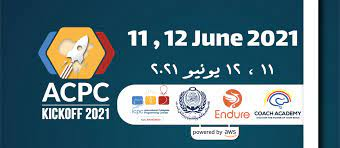
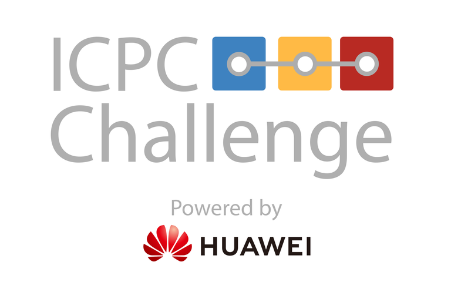
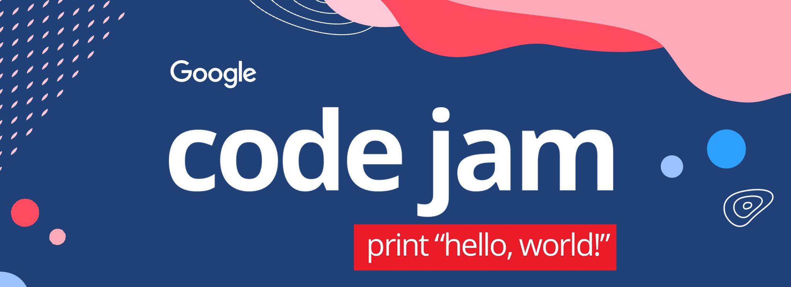

<h1> Hey there! I'm Ahmad.</h1>

# 👨🏻‍💻 &nbsp;About Me

A second year bachelor student at Innopolis University. ICPC world finalist. 

- 🤔 &nbsp; Exploring new technologies.
- 🎓 &nbsp; Studying Software Development at Innopolis University.
- 🌱 &nbsp; Learning more about Web3.

# 🛠 &nbsp;Tech Stack

- 💻 &nbsp;
  
  
  
  
  
- 🌐 &nbsp;
  
  
  
  
  
  
  
- 📱&nbsp;
  
- 🛢 &nbsp;
  
- ⚙️ &nbsp;
  
  

 

# Github Overview

 

# Programming contests performance

| Competition Name | 2021 | 2022 | 2023 |
| :----- | :----: | :----: | :----: | 
|    ICPC | Team: Bots  Al-baath level, rank: 1 | Team: Bots  Al-baath level, rank: 1  Syria level, rank: 2  Arab and Africa level: 15th | Team: Innopolis U M  Southern and Volga level, rank: 3  Northern Eurasia Finals, rank: 61 |
|   ACPC KickOff | 85th | 25th | 49th |
|   Google KickStart | Round C: 196th Round G: 318th | Round A: 59th  Round F: 156th  Round G: 97th | Farewell: 79th |
|   ICPC Huawei | - | VM placement: 32th | Buffer-sharing: 309th |
|    Google CodeJam | Round 1: 797th  Round 2: 2434th   | Round 1: 995th Round 2: 2219th  | Farewell: 79th |
|   Meta HackerCup | - | - | Round 2: 755th |

# 🤝🏻 &nbsp;Connect with Me 

